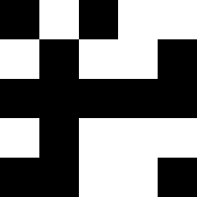
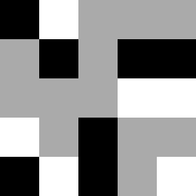
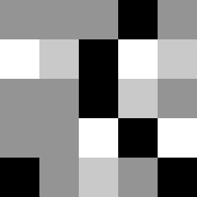

# Histogram-EQ-Small-Practice-Images
Tiny (5x5) .bmp images for my classmates to use while trying to implement a histogram EQ.

Some examples (original, very dark image on the left; post-histogram EQ on the right):

# What is histogram equalization?

[Histogram EQ](https://en.wikipedia.org/wiki/Histogram_equalization) increases the contrast in an image. It can be especially dramatic with very slight images, as you've seen. Here's `moon.bmp` from `images`, versus `moon.bmp` from `results`:

And two more:

You can find the 5x5 bitmaps in `test_images`, and their processed versions under the same name in `test_results`. `test_image_2_xxx.bmp` means that there are only 2 grayscale values in that image, so your histogram should output a purely black-and-white image

# Structure of this repo

* `test_images` and `test_results`: Anything in the latter is a correctly histogram EQ'd version of the former. These are all 5x5 bitmaps to make it easy to debug in Python, or whatever else you want to use.

* `big_test_images` and `big_test_results`: Exact same images as the previous 2, but scaled up to 250 * 250 size. (See [resize.py](./resize.py) if you want to see how to do this for a subdirectory of images automatically with [Pillow](https://www.geeksforgeeks.org/python-pil-image-resize-method/)).

* `images` and `results`: Once you have your filter working on `test_images`, you can check them against the 3 real-life images I've included above.
